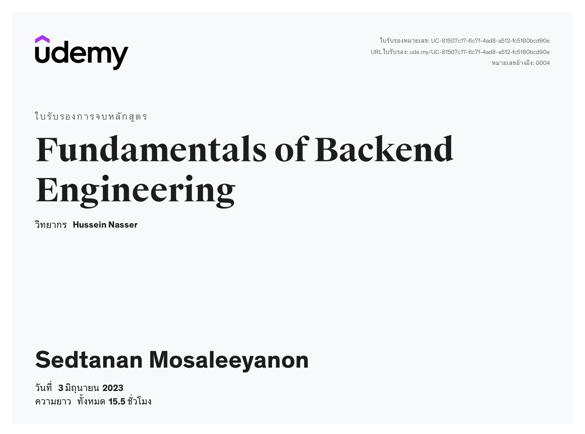
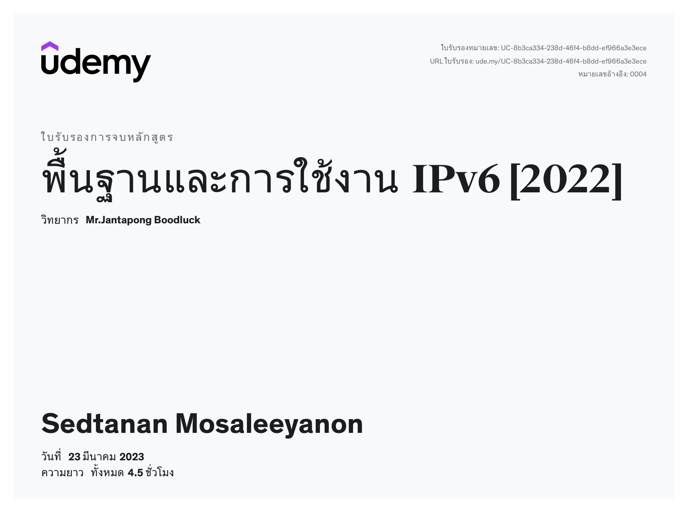
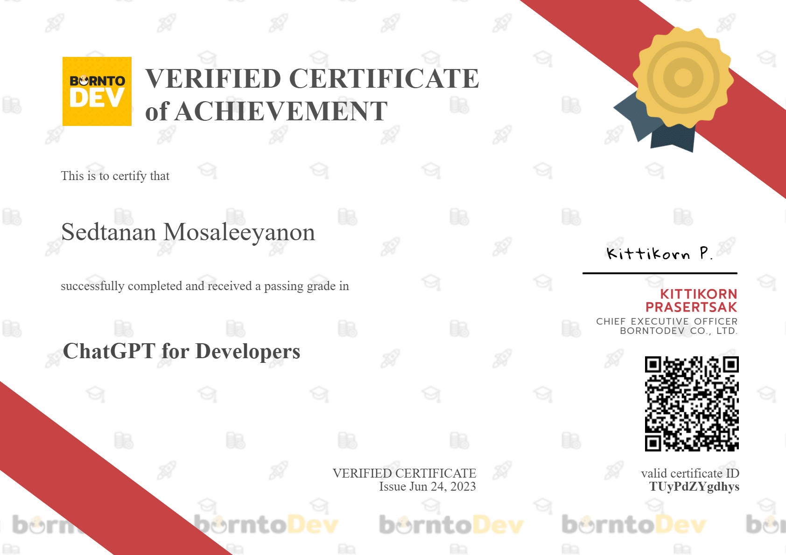
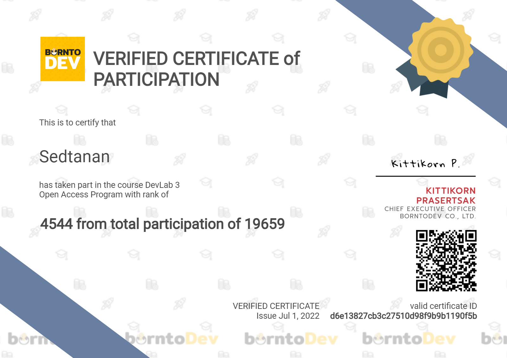
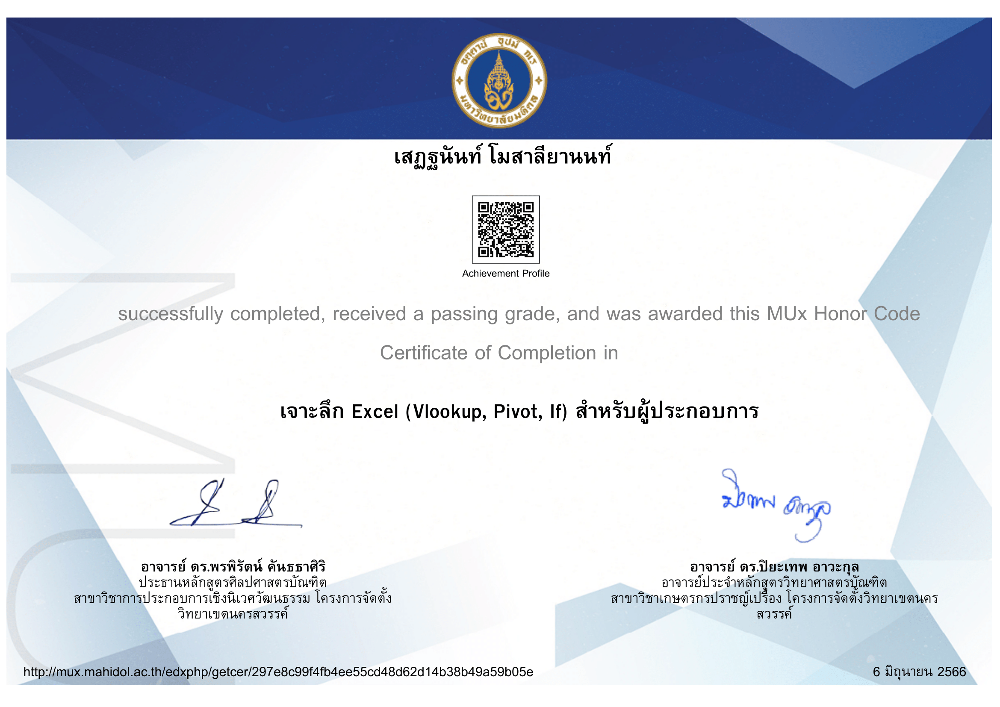
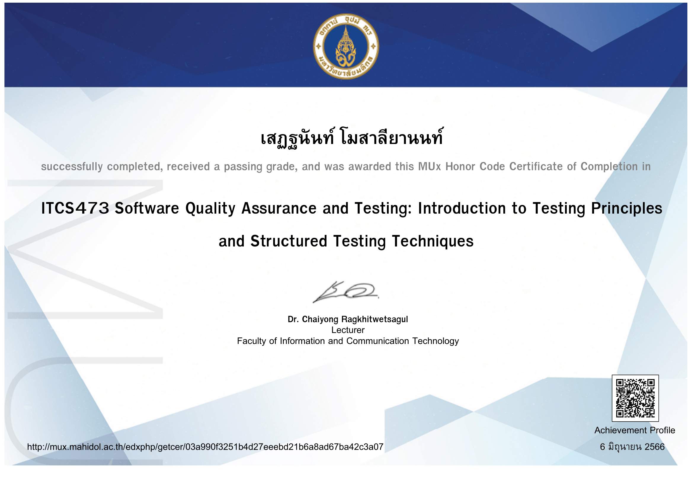

# 💫 About Me:
   🌱 I’m currently learning Spring boot, Devops and Golang

## 🌐 Socials:
  

# 💻 Tech Stack:
                                     
# 📊 GitHub Stats:
 
 

---

<!-- Proudly created with GPRM ( https://gprm.itsvg.in ) -->

## 🎖 My Certification

    
    
    
    
    
    
    
    

<!-- Proudly created with GPRM ( https://gprm.itsvg.in ) -->

<!--
**NIRVXSH/NIRVXSH** is a ✨ _special_ ✨ repository because its `README.md` (this file) appears on your GitHub profile.

Here are some ideas to get you started:

- 🔭 I’m currently working on ...
- 🌱 I’m currently learning ...
- 👯 I’m looking to collaborate on ...
- 🤔 I’m looking for help with ...
- 💬 Ask me about ...
- 📫 How to reach me: ...
- 😄 Pronouns: ...
- ⚡ Fun fact: ...
-->
